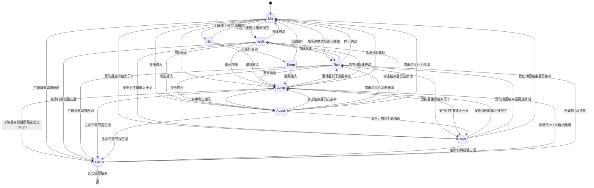

# 猫咪角色动画状态机

## 1. 素材与显示规则

当前素材帧数与原始尺寸如下：

| 动作 | 帧数 | 单帧尺寸 | 播放方式 |
|---|---:|---:|---|
| idle | 4 | 135×119 | 循环 |
| walk | 7 | 168×124 | 循环 |
| run | 7 | 197×123 | 循环 |
| jump | 7 | 177×156 | 由物理阶段选帧 |
| sit | 3 | 137×122 | 播放后保持坐姿 |
| sleep | 4 | 170×122 | 循环 |
| attack | 3 | 210×115 | 单次播放 |
| hurt | 4 | 149×133 | 单次播放 |
| fall | 4 | 148×132 | 单次播放并停在末帧 |

所有图片保持原始宽高比，并统一按照 `0.55` 倍绘制。缩放参数位于
`GameConfig::PlayerVisualScale`。

所有帧使用“脚底中心”作为统一锚点：

```text
             不同尺寸的 PNG
         ┌─────────────────┐
         │      猫咪       │
         └────────●────────┘
                  ↑
               脚底中心
                  ↓
       世界坐标中的角色碰撞箱底边中心
```

图片宽度、高度发生变化时，只会向锚点的上方和左右方向扩展，不会改变角色世界坐标，因此动作切换不会造成角色位置跳跃。

## 2. 系统职责分离

### 世界坐标

由 `Player` 保存，表示角色在游戏世界中的物理位置。世界坐标不使用 PNG 的左上角，也不随动画帧尺寸改变。

### 物理系统

由 `Player` 和 `GameController` 负责：

- 重力和垂直速度；
- 起跳、上升、最高点、下降和落地；
- 地面及火车平台着陆；
- 离开平台后下落；
- 角色与障碍物的碰撞。

### 动画系统

由 `PlayerAnimator` 负责：

- 当前动作；
- 当前动画帧；
- 帧播放速度；
- 循环和单次播放；
- 动作优先级及打断；
- 根据物理状态选择跳跃帧。

动画系统只能读取 `grounded`、`verticalSpeed` 和移动速度，不能直接修改角色物理坐标。

## 3. 状态转换图



## 4. 动作优先级

数字越大，优先级越高：

| 优先级 | 状态 | 说明 |
|---:|---|---|
| 90 | 致命 fall | 生命归零或强击退，不能被其他普通动作打断 |
| 80 | hurt | 可强制打断攻击、跳跃动画和普通移动动画 |
| 70 | attack | 攻击期间忽略重复攻击；可被 hurt 和 fall 打断 |
| 60 | jump | 由物理离地状态控制；攻击结束后若仍离地则返回 jump |
| 60 | 高空 fall | 下降高度超过阈值时使用；落地或再次起跳后退出 |
| 40 | run | 高速移动循环 |
| 30 | walk | 低速移动循环 |
| 20 | sleep | 长时间无输入循环 |
| 10 | sit | 无输入一段时间后进入 |
| 0 | idle | 默认地面状态 |

## 5. 可打断规则

| 当前状态 | Jump | Attack | Hurt | Fall | 移动输入 |
|---|---|---|---|---|---|
| idle/walk/run | 允许 | 允许 | 允许 | 允许 | 允许 |
| sit/sleep | 允许 | 允许 | 允许 | 允许 | 返回移动状态 |
| jump | 已由物理控制 | 允许 | 允许 | 允许 | 不改变垂直物理 |
| attack | 后续可扩展为仅后摇允许 | 忽略 | 强制打断 | 强制打断 | 动画结束后处理 |
| hurt | 禁止 | 禁止 | 可重新开始 hurt | 强制打断 | 动画结束后处理 |
| fall | 禁止 | 禁止 | 禁止 | 保持 fall | 禁止 |

当前实现中攻击必须完整播放，只有 `hurt` 或 `fall` 可以强制打断。

## 6. 跳跃动画阶段

跳跃高度和落地时机完全由物理系统控制，动画只根据垂直速度选择帧：

| 物理条件 | 阶段 | 使用帧 |
|---|---|---|
| 刚离地、速度小于 -12 | 起跳 | jump_01 |
| -12 至 -7 | 快速上升 | jump_02 |
| -7 至 -2 | 缓慢上升 | jump_03 |
| -2 至 2 | 最高点 | jump_04 |
| 2 至 7 | 下降 | jump_05 |
| 大于 7 | 快速下降 | jump_06 |
| 物理系统确认落地 | 落地 | jump_07 短暂播放后转入 run/walk/idle |

PNG 帧不能决定角色是否落地，否则动画和平台碰撞会逐渐不同步。

### 二段跳与高空下落

- 每次离开地面最多执行两次跳跃。
- 第一次跳跃记录起跳地面或平台的高度。
- 第二次跳跃重新设置垂直速度，但不会重置累计离地高度。
- 落地后跳跃次数恢复为 0。
- 当角色正在下降，并且相对起跳面的高度超过 `160 px` 时，动画从
  `jump` 衔接至非致命 `fall`。
- 非致命 `fall` 落地后恢复 `run/walk/idle`；如果仍有跳跃次数并再次
  起跳，则恢复 `jump`。
- 生命归零或强击退触发的是致命 `fall`，不可通过跳跃退出。

对应参数：

```cpp
inline constexpr int MaxJumpCount = 2;
inline constexpr double HighFallThreshold = 160.0;
```

## 7. 攻击阶段

当前攻击共有三帧：

| 帧 | 阶段 | 攻击判定 |
|---|---|---|
| attack_01 | 前摇 | 无 |
| attack_02 | 生效帧 | 创建一次攻击判定 |
| attack_03 | 后摇 | 无 |

`PlayerAnimator::takeAttackActivation()` 只在动画首次进入第二帧时返回一次 `true`。`GameController` 据此发出 `attackHitboxCreated`，不会在前摇、后摇或同一生效帧内重复创建判定。

当前按键为 `J`。

## 8. 无操作状态

仅当地面水平速度为 0 时累计无操作时间：

```text
0～4 秒       idle 循环
4～9 秒      sit 播放并保持坐姿
9 秒以后     sleep 循环
```

任何移动、跳跃、攻击或受伤都会退出该链路。在当前自动跑酷玩法中，世界速度始终处于跑步阈值，因此正常游戏时使用 `run`；当后续加入起跑前等待、关卡结束或自由移动模式时，`idle → sit → sleep` 会自动生效。

## 9. 每帧更新伪代码

```cpp
void updateFrame()
{
    // 1. 更新世界对象，但不改变角色动画锚点。
    moveBackground();
    moveCoins();
    moveObstacles();

    // 2. 物理系统独立更新。
    if (platformNoLongerUnderPlayer())
        player.leaveSurface();

    player.applyGravity();
    player.integratePosition();
    resolvePlatformLanding();

    // 3. 动画系统只读取物理结果。
    animator.update(
        deltaTime,
        player.isOnGround(),
        player.verticalSpeed(),
        currentHorizontalSpeed);

    // 4. 攻击只在生效帧创建一次判定。
    if (animator.takeAttackActivation())
        createAttackHitbox();

    // 5. 将世界位置和当前图片分别交给渲染层。
    canvas.setPlayerPosition(player.position());
    canvas.setPlayerFrame(animator.currentFrame());
}
```

## 10. 代码位置

- `src/entities/player.*`：角色世界位置和跳跃物理。
- `src/animation/playeranimator.*`：动作状态机和帧播放。
- `src/game/gamecontroller.*`：组合物理、动画、攻击和游戏规则。
- `src/game/gamecanvas.*`：以统一锚点绘制当前 PNG。
- `src/config/gameconfig.h`：显示比例、碰撞箱和物理参数。
- `resources/images/player/`：所有动作帧。

新增动作时，应先向 `PlayerAction` 添加状态，再在 `PlayerAnimator` 构造函数中登记帧数、帧间隔和循环方式。不要在 `GameCanvas` 中编写状态转换逻辑。
